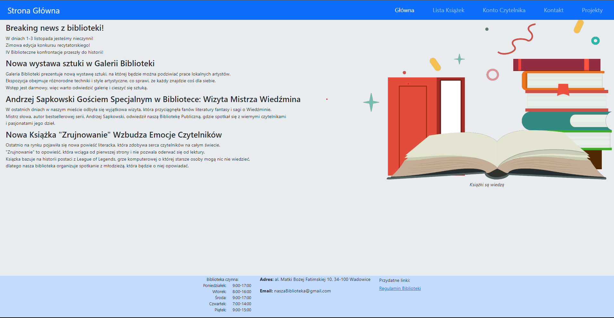
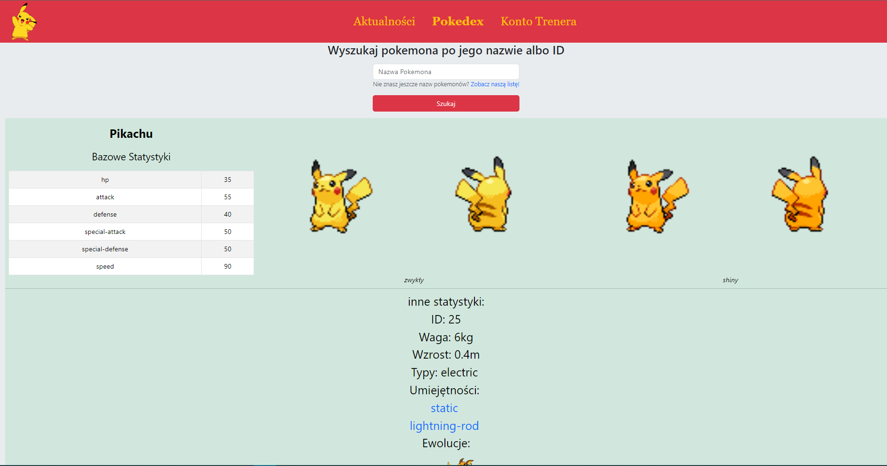
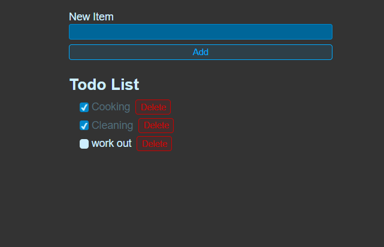
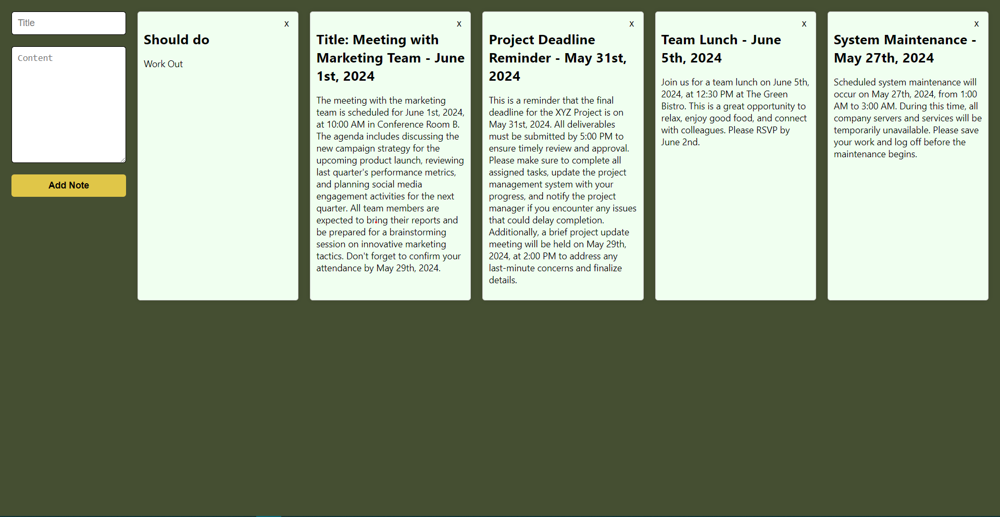
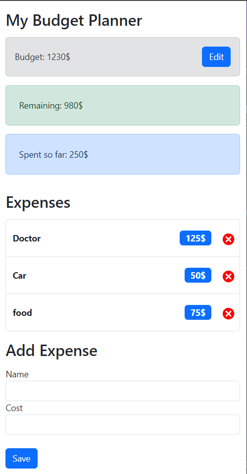

# WebDev Projects

## Static site
- html
- css
- javascript
- bootstrap

## Dynamic site
- pug
- javascript
- css
- Bootstrap
- Express.js
- Node.js
- sqlite3

## Todo App 
- react

  

## Notes App
- react
- prisma
- Express.js
- to work a database_url is needed (.env file)

  

## Budget Planner App
- react
- typescript

